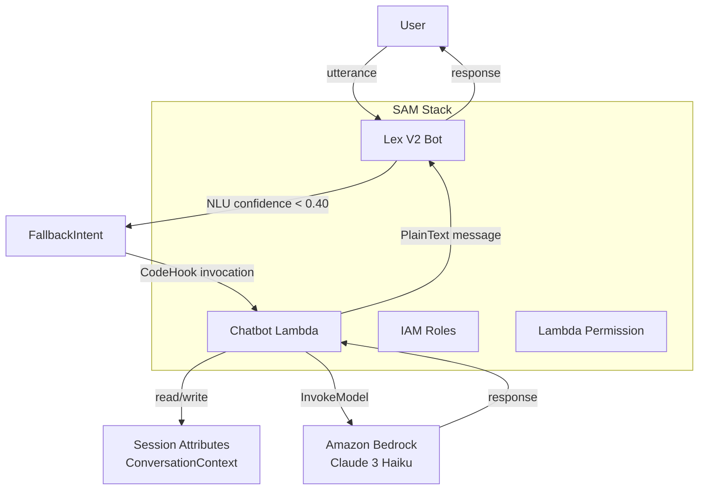
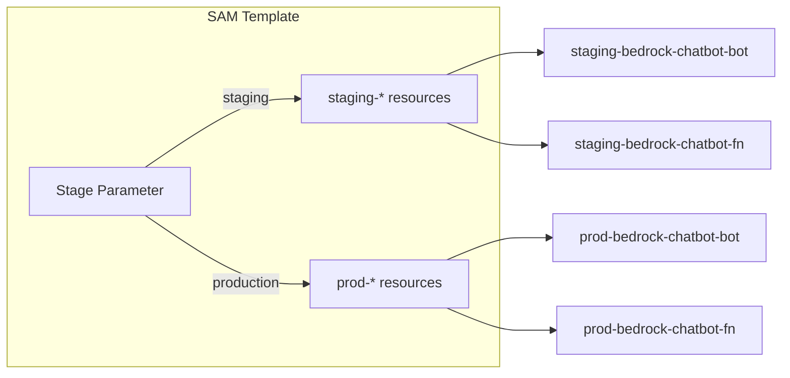

# Design Document: Lex Bedrock Chatbot

## Overview

This design replaces the legacy SageMaker/LangChain-based Lex V2 chatbot with a streamlined architecture using Amazon Bedrock as the LLM provider. The system is defined entirely as Infrastructure as Code via AWS SAM, parameterized for staging and production environments.

The core interaction flow is:

1. User sends a message to the Lex V2 bot
2. Lex routes unrecognized input (below NLU confidence threshold) to the FallbackIntent
3. FallbackIntent triggers the fulfillment Lambda function
4. Lambda retrieves conversation history from Lex session attributes
5. Lambda constructs a prompt with system instruction + history + user input
6. Lambda calls Bedrock InvokeModel API (Claude Messages API)
7. Lambda extracts the response, updates session history, and returns to Lex
8. Lex delivers the response to the user

**Key design decisions:**
- **Single-module Lambda**: No dispatcher pattern, no external dependencies beyond boto3. The existing multi-file SageMaker/LangChain architecture is replaced with one file.
- **Bedrock Messages API**: Uses the Claude Messages API format (`anthropic_version: bedrock-2023-05-31`) which structures conversation as role-based messages rather than raw text completion.
- **Session-based memory**: Conversation history lives in Lex V2 session attributes — no external database required. Bounded to 10,000 characters with FIFO eviction of oldest exchange pairs.
- **SAM-native IaC**: All resources (Lex bot, Lambda, IAM roles, permissions) in a single `template.yaml` with a `Stage` parameter controlling naming and isolation.

## Architecture



### Deployment Architecture



## Components and Interfaces

### 1. SAM Template (`template.yaml`)

The single SAM template defines all infrastructure resources.

**Parameters:**
| Parameter | Type | Default | Description |
|-----------|------|---------|-------------|
| Stage | String | staging | Deployment stage (staging/production) |
| BedrockModelId | String | anthropic.claude-3-haiku-20240307-v1:0 | Bedrock model identifier |
| SystemPrompt | String | (default prompt) | Override system instruction |

**Resources defined:**
- `ChatbotLambda` — AWS::Serverless::Function (Python 3.12, 256 MB, 30s timeout)
- `ChatbotLambdaRole` — AWS::IAM::Role (bedrock:InvokeModel + CloudWatch Logs)
- `LexBot` — AWS::Lex::Bot (en_US locale, FallbackIntent with CodeHook)
- `LexBotVersion` — AWS::Lex::BotVersion
- `LexBotAlias` — AWS::Lex::BotAlias (linked to Lambda via CodeHookSpecification)
- `LexInvokeLambdaPermission` — AWS::Lambda::Permission (lex.amazonaws.com principal)

### 2. Lambda Function (`src/handler.py`)

Single Python module with the following internal structure:

```python
# Module-level initialization
import json
import logging
import os
import boto3

# Structured logger setup
logger = logging.getLogger()
logger.setLevel(logging.INFO)

# Environment variable validation (fail-fast at cold start)
BEDROCK_MODEL_ID = os.environ.get("BEDROCK_MODEL_ID", "")
# System prompt resolution: use env var if set and non-empty, otherwise ALWAYS fall back to default.
# This applies when env var is missing, empty string, or any other invalid source.
SYSTEM_PROMPT = os.environ.get("SYSTEM_PROMPT", "") or DEFAULT_SYSTEM_PROMPT

# Bedrock client initialization
bedrock_runtime = boto3.client("bedrock-runtime")
```

**Key functions:**

| Function | Responsibility |
|----------|---------------|
| `lambda_handler(event, context)` | Entry point. Routes FallbackIntent to LLM flow; for non-FallbackIntent events, returns a Close response (LLM invocation for monitoring purposes is permitted, but no LLM-generated content is returned to the user). |
| `invoke_bedrock(messages, system_prompt)` | Calls Bedrock InvokeModel with Messages API payload. Returns generated text. On error, returns error message to user regardless of whether logging succeeds (logging is best-effort). |
| `get_conversation_context(session_attributes)` | Retrieves and deserializes ConversationContext from session attributes. Initializes default context only when the "ConversationContext" key is completely absent; an empty string value does NOT trigger re-initialization. Handles malformed JSON by discarding and re-initializing. |
| `update_conversation_context(context, user_input, ai_response)` | Appends new exchange, enforces 10,000-char limit via FIFO truncation. |
| `build_messages(conversation_context, user_input)` | Converts stored history + current input into Claude Messages API format. Limits to 10 most recent turns. |
| `build_lex_response(session_attributes, intent_request, message)` | Constructs Lex V2 Close response with updated session attributes. |

### 3. Lex V2 Bot (CloudFormation resource)

The Lex bot is defined declaratively in the SAM template:

- **Locale**: en_US
- **NLU Confidence Threshold**: 0.40
- **Idle Session TTL**: 300 seconds
- **Child-directed**: false
- **Intents**: FallbackIntent only (ParentIntentSignature: AMAZON.FallbackIntent)
- **FulfillmentCodeHook**: Enabled, pointing to the `ChatbotLambda` resource (specifically referenced by logical ID in the SAM template) via BotAlias CodeHookSpecification

### 4. IAM Role (`ChatbotLambdaRole`)

Least-privilege policy with two statements:

```yaml
Policies:
  - PolicyName: BedrockInvokePolicy
    PolicyDocument:
      Statement:
        - Effect: Allow
          Action: bedrock:InvokeModel
          Resource: !Sub "arn:aws:bedrock:${AWS::Region}::foundation-model/${BedrockModelId}"
        - Effect: Allow
          Action:
            - logs:CreateLogGroup
            - logs:CreateLogStream
            - logs:PutLogEvents
          Resource: !Sub "arn:aws:logs:${AWS::Region}:${AWS::AccountId}:log-group:/aws/lambda/${Stage}-bedrock-chatbot-fn:*"
```

## Data Models

### Lex V2 Event (Lambda Input)

```json
{
  "sessionId": "string",
  "inputTranscript": "Tell me about Amazon",
  "bot": {
    "id": "string",
    "name": "string",
    "localeId": "en_US",
    "version": "DRAFT"
  },
  "sessionState": {
    "intent": {
      "name": "FallbackIntent",
      "state": "InProgress"
    },
    "sessionAttributes": {
      "ConversationContext": "{\"chat_history\": \"Human: hi\\nAI: Hello! How can I help you?\"}"
    }
  },
  "requestAttributes": {}
}
```

### ConversationContext (Session Attribute Value)

```json
{
  "chat_history": "Human: Tell me about Tesla\nAI: Tesla, Inc. is an American electric vehicle and clean energy company...\nHuman: Who founded it?\nAI: Tesla was incorporated in 2003 by Martin Eberhard and Marc Tarpenning..."
}
```

**Constraints:**
- Stored as JSON-serialized string in Lex session attributes
- Maximum 10,000 characters total
- Truncation removes oldest complete `Human: ...\nAI: ...` pairs
- Maximum 10 conversation turns passed to Bedrock prompt

### Bedrock Request Payload (Claude Messages API)

```json
{
  "anthropic_version": "bedrock-2023-05-31",
  "max_tokens": 1024,
  "system": "You are a helpful corporate research assistant. Provide fact-based descriptions of corporations using reliable sources such as Wikipedia and official company reports. Be concise and accurate.",
  "messages": [
    {"role": "user", "content": [{"type": "text", "text": "Tell me about Tesla"}]},
    {"role": "assistant", "content": [{"type": "text", "text": "Tesla, Inc. is an American electric vehicle..."}]},
    {"role": "user", "content": [{"type": "text", "text": "Who founded it?"}]}
  ]
}
```

### Bedrock Response Payload

```json
{
  "id": "msg_...",
  "type": "message",
  "role": "assistant",
  "content": [
    {"type": "text", "text": "Tesla was incorporated in 2003 by Martin Eberhard and Marc Tarpenning..."}
  ],
  "stop_reason": "end_turn"
}
```

### Lex V2 Response (Lambda Output)

```json
{
  "sessionState": {
    "dialogAction": {"type": "Close"},
    "intent": {
      "name": "FallbackIntent",
      "state": "Fulfilled"
    },
    "sessionAttributes": {
      "ConversationContext": "{\"chat_history\": \"Human: ...\\nAI: ...\"}"
    }
  },
  "messages": [
    {"contentType": "PlainText", "content": "Tesla was incorporated in 2003..."}
  ]
}
```

### Project File Structure (Post-Cleanup)

```
.
├── template.yaml              # SAM template (all IaC)
├── src/
│   └── handler.py             # Single Lambda module
├── tests/
│   ├── unit/
│   │   └── test_handler.py    # Unit + property tests
│   └── events/
│       └── fallback_event.json # Sample Lex event
├── samconfig.toml             # SAM deployment config
├── .gitignore                 # Excludes .DS_Store, __pycache__, *.zip, .env
└── README.md                  # Setup and deployment guide
```


## Correctness Properties

*A property is a characteristic or behavior that should hold true across all valid executions of a system — essentially, a formal statement about what the system should do. Properties serve as the bridge between human-readable specifications and machine-verifiable correctness guarantees.*

### Property 1: Prompt construction invariant

*For any* valid conversation context (0–20 turns) and any non-empty user input string, the constructed Bedrock messages payload SHALL contain:
- A system instruction string (either default or overridden)
- At most 10 most recent conversation turns as alternating user/assistant messages
- The current user input as the final user message

**Validates: Requirements 1.1, 1.5, 7.1**

### Property 2: Response extraction produces valid Lex format

*For any* valid Bedrock response containing a non-empty text content block, extracting the response and building the Lex return payload SHALL produce a response with `messages[0].contentType` equal to `"PlainText"` and `messages[0].content` equal to the text from the Bedrock response content block.

**Validates: Requirements 1.2**

### Property 3: Context update preserves exchange format

*For any* existing conversation context string, any non-empty user input, and any non-empty AI response, updating the conversation context SHALL produce a string where the appended portion matches the pattern `"Human: {input}\nAI: {response}"` and the previous history is preserved as a prefix.

**Validates: Requirements 1.6, 2.2**

### Property 4: Context serialization round-trip

*For any* valid ConversationContext object (containing a `chat_history` string field), serializing to JSON and then deserializing SHALL produce an object with an identical `chat_history` value.

**Validates: Requirements 2.3**

### Property 5: Truncation maintains size invariant

*For any* conversation context string that exceeds 10,000 characters after an update, the truncation function SHALL produce a result that:
- Has total length ≤ 10,000 characters
- Contains only complete exchange pairs (no partial Human/AI turns)
- Retains the most recent exchanges (oldest are removed first)

**Validates: Requirements 2.5**

### Property 6: Malformed JSON recovery

*For any* string that is not valid JSON, attempting to retrieve the conversation context SHALL produce the default initialized context (a JSON object with `chat_history` set to the default greeting prompt), rather than raising an exception.

**Validates: Requirements 2.6**

### Property 7: Non-FallbackIntent routing

*For any* Lex V2 event where `sessionState.intent.name` is not `"FallbackIntent"`, the Lambda handler SHALL return a Close dialog action without invoking the Bedrock API.

**Validates: Requirements 6.4**

## Error Handling

| Error Condition | Behavior | User Message |
|----------------|----------|--------------|
| `BEDROCK_MODEL_ID` missing/empty | Attempt to log error (best-effort); return error response to user regardless of whether logging succeeds | "I'm sorry, the service is temporarily unavailable. Please try again later." |
| Bedrock `InvokeModel` API error | Attempt to log error type + message (best-effort); return graceful failure message to user regardless of whether logging succeeds | "I'm sorry, I couldn't process your request. Please try again." |
| Bedrock response missing content | Log warning, return fallback message | "I'm sorry, I didn't get a valid response. Please try again." |
| Malformed `ConversationContext` JSON | Log warning, re-initialize empty context, continue processing | (no user-facing error — conversation resets silently) |
| `ConversationContext` key absent from session attributes | Initialize default context with greeting prompt | (no user-facing error — normal initialization) |
| `ConversationContext` key present but empty string | Treat as valid value (empty string); do NOT re-initialize | (no user-facing error — value preserved as-is) |
| Non-FallbackIntent event | Return Close action immediately; LLM invocation for monitoring is permitted but no LLM content returned to user | (no LLM-generated message — Lex handles it) |
| Lambda invocation fails during FallbackIntent fulfillment | Lex provides a fallback error message to the user before ending the conversation | "I'm sorry, something went wrong. Please try again later." (Lex-configured fallback) |
| Lambda timeout (30s) | Lex detects timeout, provides fallback error message, ends conversation | Lex-configured timeout/error message |
| System prompt unavailable (env var empty or missing, no valid prompt from any source) | Always fall back to default system prompt — never operate without a prompt | (no user-facing error — default prompt used transparently) |

**Error Message Delivery Guarantee:**
Error messages to users MUST be returned even if logging fails. The pattern is:
1. Attempt to log the error (best-effort, wrapped in try/except)
2. Return the user-facing error message unconditionally

This ensures users always receive feedback about failures, even under degraded logging infrastructure.

**Logging strategy:**
- All errors logged with `logger.error()` including exception type and message
- Logging failures are caught silently and never prevent error messages from reaching the user
- Operational events (cold start, intent routing, Bedrock call) logged with `logger.info()`
- Debug-level logging for full request/response payloads (controlled by LOG_LEVEL env var)

## Testing Strategy

### Unit Tests (example-based)

Unit tests target specific scenarios and edge cases using `pytest` with `moto` or `unittest.mock` for AWS service mocking:

| Test Case | Validates |
|-----------|-----------|
| FallbackIntent event triggers Bedrock call | Req 1.1 |
| Missing BEDROCK_MODEL_ID returns error | Req 1.4 |
| Bedrock API error returns graceful message | Req 1.7 |
| Empty session attributes initializes default context | Req 2.4 |
| Non-FallbackIntent returns close without Bedrock call | Req 6.4 |
| SYSTEM_PROMPT env var overrides default | Req 7.2 |
| Empty SYSTEM_PROMPT env var uses default | Req 7.4 |
| Default system prompt contains corporate description instruction | Req 7.3 |
| Structured log output contains expected fields | Req 6.2 |

### Property-Based Tests

Property-based tests use `hypothesis` (Python) to verify universal properties across generated inputs. Each property test runs a minimum of 100 iterations.

| Property Test | Tag | Generators |
|--------------|-----|------------|
| Prompt construction invariant | Feature: lex-bedrock-chatbot, Property 1 | Random strings for user input, random lists of (human, ai) string tuples for history (0-20 turns) |
| Response extraction | Feature: lex-bedrock-chatbot, Property 2 | Random non-empty strings for Bedrock response content |
| Context update format | Feature: lex-bedrock-chatbot, Property 3 | Random strings for existing context, user input, and AI response |
| Serialization round-trip | Feature: lex-bedrock-chatbot, Property 4 | Random ConversationContext dicts with `chat_history` string |
| Truncation invariant | Feature: lex-bedrock-chatbot, Property 5 | Random conversation strings exceeding 10,000 chars with valid exchange pair format |
| Malformed JSON recovery | Feature: lex-bedrock-chatbot, Property 6 | Random strings that fail `json.loads()` (binary data, partial JSON, plain text) |
| Non-FallbackIntent routing | Feature: lex-bedrock-chatbot, Property 7 | Random Lex event dicts with intent names other than "FallbackIntent" |

### IaC Validation (SAM template)

SAM template correctness is verified via:
- `sam validate` — syntax and schema validation
- `sam build` — confirms template is deployable
- Manual review checklist for Requirement 3 and 4 acceptance criteria (IAM policies, resource naming, parameters)

### Integration Tests

Post-deployment verification against a staging stack:
- Send utterance to Lex bot, verify LLM response returned
- Verify multi-turn conversation maintains context
- Verify Lambda CloudWatch logs contain structured entries
- Verify Lex session timeout behavior (300s idle)
