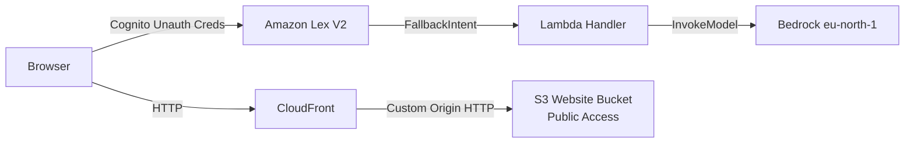
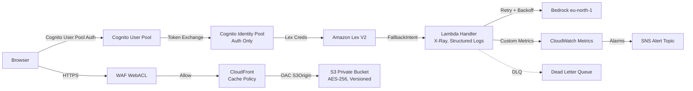
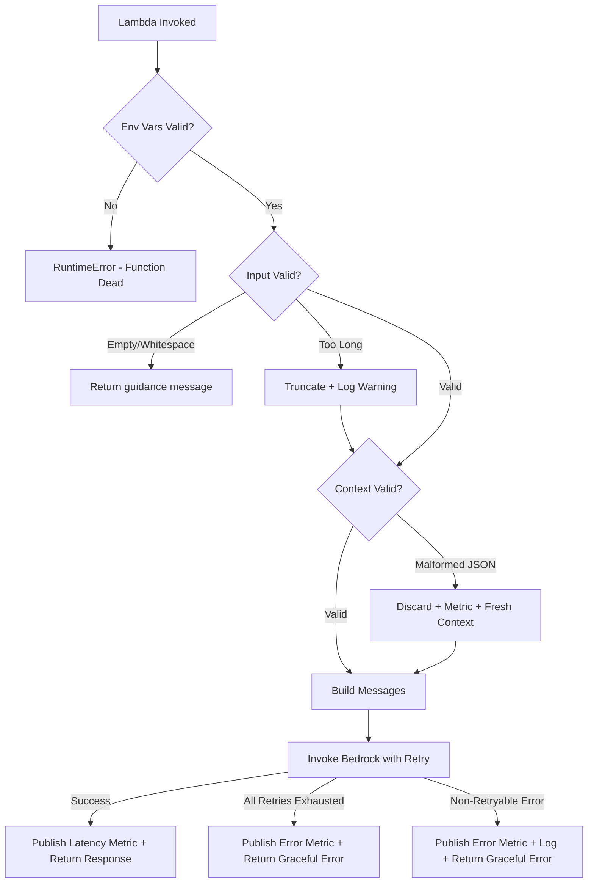

# Design Document: Production Hardening

## Overview

This design transforms the existing staging Lex V2 Bedrock Chatbot into a production-grade deployment across five pillars: Security, Reliability & Performance, Observability, Operations & CI/CD, and Code Hardening.

The changes span the SAM template (infrastructure), the Lambda handler (application logic), a CI/CD pipeline definition, and integration test scripts. The single-template, single-Lambda architecture is preserved — no new services or external dependencies beyond the AWS SDK are introduced.

### Design Principles

- **Single SAM template**: All infrastructure remains in `template.yaml` — no nested stacks
- **No external Python dependencies**: Retry logic, structured logging, and metrics use only boto3/botocore (bundled in Lambda runtime)
- **Stage-parameterized**: Production vs. staging differences are controlled via the existing `Stage` parameter and `Conditions`
- **Backwards compatible**: The Web UI, Lex bot configuration, and existing test suite continue to work

## Architecture

### Current State (Staging)



### Target State (Production)



### Key Architectural Changes

| Layer | Current | Target |
|-------|---------|--------|
| S3 Access | Public website endpoint | Private bucket + OAC |
| Auth | Cognito unauth identities | Cognito User Pool + auth-only Identity Pool |
| WAF | None | AWS Managed Rules + rate limiting |
| Lambda Resilience | No retries, 30s timeout | 3-retry exponential backoff, 60s timeout, DLQ |
| Observability | Basic Python logging | Structured JSON logs, X-Ray, custom metrics, alarms |
| Deployment | Manual `sam deploy` | CI/CD pipeline with staging → production gates |
| Input Safety | No validation | 1000-char truncation, whitespace rejection |
| Cold Start | Silent failure | Fail-fast env var validation |

## Components and Interfaces

### 1. SAM Template Components (template.yaml)

#### 1.1 S3 + CloudFront + WAF (Requirements 1, 4, 5, 10)

- **WebUIBucket**: Private bucket (all `PublicAccessBlockConfiguration` = true), no `WebsiteConfiguration`, SSE-S3 encryption, versioning enabled
- **CloudFrontOAC**: `AWS::CloudFront::OriginAccessControl` with `OriginAccessControlOriginType: s3`, `SigningBehavior: always`, `SigningProtocol: sigv4`
- **WebUICloudFront**: S3 origin using regional domain name + OAC reference, custom cache policy (TTL 0/60/300), `WebACLId` referencing WAF
- **WebUIBucketPolicy**: Grants `s3:GetObject` only to `cloudfront.amazonaws.com` conditioned on distribution ARN
- **WAFWebACL**: Defined with `AWS::WAFv2::WebACL` (scope: CLOUDFRONT). Contains:
  - `AWSManagedRulesCommonRuleSet` (priority 1)
  - IP rate-based rule: 1000 requests/5min (priority 2)

**Design Decision — WAF Region**: CloudFront-associated WAFs must be in `us-east-1`. Since the main stack is in `eu-central-1`, we define the WAF WebACL using `AWS::WAFv2::WebACL` with scope `CLOUDFRONT`. WAFv2 resources with CLOUDFRONT scope are inherently global and can be defined in the same template regardless of the stack's deploy region.

#### 1.2 Cognito Authentication (Requirement 2)

- **CognitoUserPool**: `AWS::Cognito::UserPool` with password policy (min 8 chars, upper, lower, number, symbol)
- **CognitoUserPoolClient**: `AWS::Cognito::UserPoolClient` with `AllowedOAuthFlows: [code]`, `AllowedOAuthScopes: [openid, email, profile]`
- **CognitoIdentityPool**: `AllowUnauthenticatedIdentities: false`, linked to User Pool via `CognitoIdentityProviders`
- **CognitoAuthRole**: Replaces `CognitoUnauthRole` — same Lex permissions (`lex:RecognizeText`, `lex:RecognizeUtterance`, `lex:DeleteSession`, `lex:PutSession`) scoped to bot alias ARN
- **Remove**: `CognitoUnauthRole` and unauthenticated role mapping

#### 1.3 IAM Scoping (Requirement 3)

- **ChatbotLambdaRole**: Restrict Bedrock `InvokeModel` resource ARN to `eu-north-1` only (replace `*` region). Add `sqs:SendMessage` for DLQ. Add `xray:PutTraceSegments`, `xray:PutTelemetryRecords`. Add `cloudwatch:PutMetricData` conditioned on namespace `ProductionChatbot`.
- **LexBotRole**: Scope `polly:SynthesizeSpeech` to `arn:aws:polly:${AWS::Region}:${AWS::AccountId}:lexicon/*`

#### 1.4 Lambda Configuration (Requirements 6, 7, 8, 13)

- **ReservedConcurrentExecutions**: Conditional — 10 for staging, 50 for production
- **ProvisionedConcurrency**: 2 for production only (via `AWS::Lambda::Alias` + `ProvisionedConcurrencyConfig`)
- **Timeout**: 60 seconds
- **Tracing**: `Active`
- **DeadLetterQueue**: Reference SQS DLQ ARN
- **DLQ Resource**: `AWS::SQS::Queue` with `MessageRetentionPeriod: 1209600` (14 days)

#### 1.5 CloudWatch Alarms + SNS (Requirement 12)

- **AlarmTopic**: `AWS::SNS::Topic`
- **LambdaErrorAlarm**: `Errors / Invocations > 0.05` over 5 minutes
- **LambdaDurationAlarm**: p99 Duration > 45000ms over 5 minutes
- **LexMissedUtteranceAlarm**: `MissedUtteranceCount > 20` over 5 minutes
- All alarms publish to `AlarmTopic`
- **Output**: `AlarmTopicArn` exposed as stack output

### 2. Lambda Handler Components (src/handler.py)

#### 2.1 Environment Validation Module (Requirement 20)

```python
# At module level (cold start)
REQUIRED_ENV_VARS = ["BEDROCK_MODEL_ID", "BEDROCK_REGION"]

def _validate_environment():
    missing = [var for var in REQUIRED_ENV_VARS if not os.environ.get(var)]
    if missing:
        # Log structured CRITICAL entry with event_type: env_validation_failure
        # Raise RuntimeError listing all missing vars
        ...

_validate_environment()  # Called at module load
```

#### 2.2 Structured Logging Module (Requirement 11)

A lightweight `StructuredLogger` class that emits single-line JSON to stdout:

```python
class StructuredLogger:
    def log(self, level, message, **extra):
        entry = {
            "timestamp": datetime.utcnow().isoformat() + "Z",
            "level": level,
            "message": message,
            "request_id": self._request_id,
            **extra
        }
        print(json.dumps(entry, default=str))
```

Fields: `timestamp`, `level`, `message`, `request_id`, `intent_name`, `session_id`, `bedrock_latency_ms`, `error_type`, `error_message`, `event_type`.

#### 2.3 Retry Engine (Requirement 9)

```python
def invoke_bedrock_with_retry(messages, system_prompt):
    """Retry with exponential backoff + jitter for transient errors."""
    RETRY_CONFIG = {
        "ThrottlingException": {"max_retries": 3, "base_delay": 1.0},
        "ServiceUnavailableException": {"max_retries": 3, "base_delay": 1.0},
        "ModelTimeoutException": {"max_retries": 2, "base_delay": 2.0},
    }
    for attempt in range(max_retries + 1):
        try:
            return _invoke_bedrock_once(messages, system_prompt)
        except ClientError as e:
            code = e.response["Error"]["Code"]
            config = RETRY_CONFIG.get(code)
            if not config or attempt >= config["max_retries"]:
                raise
            delay = config["base_delay"] * (2 ** attempt) + random.uniform(0, 0.5)
            # Log structured retry entry
            time.sleep(delay)
    return GRACEFUL_ERROR_MESSAGE
```

- `ThrottlingException` / `ServiceUnavailableException`: up to 3 retries, base 1s
- `ModelTimeoutException`: up to 2 retries, base 2s
- Jitter: random 0–500ms added to each delay

#### 2.4 Input Validation (Requirement 18)

```python
def validate_input(input_transcript):
    """Validate and truncate input. Returns (clean_input, should_proceed)."""
    if not input_transcript or not input_transcript.strip():
        return None, False  # Caller returns early message
    if len(input_transcript) > 1000:
        # Log warning with original length
        input_transcript = input_transcript[:1000]
    return input_transcript, True
```

#### 2.5 Custom Metrics Publisher (Requirements 14, 19)

```python
cloudwatch = boto3.client("cloudwatch")

def publish_metric(metric_name, value, unit="Milliseconds", dimensions=None):
    """Publish to ProductionChatbot namespace."""
    cloudwatch.put_metric_data(
        Namespace="ProductionChatbot",
        MetricData=[{
            "MetricName": metric_name,
            "Value": value,
            "Unit": unit,
            "Dimensions": dimensions or []
        }]
    )
```

Metrics: `BedrockLatency` (ms), `BedrockError` (count, with `ErrorType` dimension), `ContextCorruption` (count).

#### 2.6 X-Ray Integration (Requirement 13)

```python
from aws_xray_sdk.core import xray_recorder
# aws_xray_sdk is bundled in the Lambda Python 3.12 runtime

@xray_recorder.capture("BedrockInvokeModel")
def _invoke_bedrock_once(messages, system_prompt):
    ...
```

**Design Decision — X-Ray SDK**: The `aws_xray_sdk` is available in the Lambda Python 3.12 runtime without adding external dependencies. We use `@xray_recorder.capture()` to create a named subsegment for each Bedrock call.

#### 2.7 Graceful Degradation (Requirement 19)

Enhanced `get_conversation_context()` to:
1. Detect malformed JSON (existing behavior)
2. Log structured warning with `event_type: "context_corruption"`
3. Publish `ContextCorruption` metric to `ProductionChatbot` namespace
4. Return fresh default context and continue processing

### 3. CI/CD Pipeline (Requirements 15, 16, 17)

#### Pipeline Definition (GitHub Actions)

File: `.github/workflows/deploy.yml`

```yaml
stages:
  - lint        # ruff check
  - unit-test   # pytest tests/unit/
  - build       # sam build
  - deploy-staging    # sam deploy → staging-bedrock-chatbot (Stage=staging)
  - integration-test  # invoke Lex bot + check CloudFront 200
  - deploy-production # sam deploy → production-bedrock-chatbot (Stage=production)
  - post-deploy       # enable termination protection
```

#### Integration Test Script

File: `tests/integration/test_deployed.py`

- Uses boto3 `lexv2-runtime` to send a message and verify non-empty response
- Uses `requests` (or `urllib3`) to GET the CloudFront URL and assert HTTP 200
- Fails pipeline if any check fails

## Data Models

### Structured Log Entry Schema

```json
{
  "timestamp": "2024-01-15T10:30:00.000Z",
  "level": "INFO | WARNING | ERROR | CRITICAL",
  "message": "string",
  "request_id": "aws-request-id",
  "intent_name": "FallbackIntent",
  "session_id": "lex-session-id",
  "bedrock_latency_ms": 1250,
  "error_type": "ThrottlingException",
  "error_message": "Rate exceeded",
  "event_type": "context_corruption | env_validation_failure | retry_attempt",
  "retry_attempt": 2,
  "retry_delay_ms": 2350
}
```

### Custom CloudWatch Metrics

| Metric Name | Namespace | Unit | Dimensions |
|------------|-----------|------|------------|
| BedrockLatency | ProductionChatbot | Milliseconds | — |
| BedrockError | ProductionChatbot | Count | ErrorType |
| ContextCorruption | ProductionChatbot | Count | — |

### CloudWatch Alarm Thresholds

| Alarm | Metric | Threshold | Period | Statistic |
|-------|--------|-----------|--------|-----------|
| LambdaErrorRate | Errors/Invocations | > 5% | 5 min | Average |
| LambdaDurationP99 | Duration | > 45,000 ms | 5 min | p99 |
| LexMissedUtterances | MissedUtteranceCount | > 20 | 5 min | Sum |

### WAF Rule Configuration

| Rule | Priority | Action | Details |
|------|----------|--------|---------|
| AWSManagedRulesCommonRuleSet | 1 | Block (managed) | SQL injection, XSS, etc. |
| IPRateLimit | 2 | Block | 1000 requests / 5 min / IP |

### Cognito User Pool Password Policy

```json
{
  "MinimumLength": 8,
  "RequireUppercase": true,
  "RequireLowercase": true,
  "RequireNumbers": true,
  "RequireSymbols": true
}
```

## Correctness Properties

*A property is a characteristic or behavior that should hold true across all valid executions of a system — essentially, a formal statement about what the system should do. Properties serve as the bridge between human-readable specifications and machine-verifiable correctness guarantees.*

The following properties apply to the Lambda handler code changes (Requirements 9, 11, 14, 18, 19, 20). Infrastructure requirements (1–8, 10, 12, 13, 15–17) are validated via template assertion tests and integration tests, not property-based testing, because they are declarative IaC configuration with no meaningful input variation.

### Property 1: Retry logic respects exception-specific configuration

*For any* sequence of retryable Bedrock exceptions (`ThrottlingException`, `ServiceUnavailableException`, `ModelTimeoutException`), the retry engine SHALL:
- Retry `ThrottlingException` / `ServiceUnavailableException` up to 3 times
- Retry `ModelTimeoutException` up to 2 times
- Return the graceful error message "I'm sorry, the service is temporarily busy. Please try again in a moment." when all retries are exhausted
- Return the successful response if any retry succeeds

**Validates: Requirements 9.1, 9.2, 9.3**

### Property 2: Retry backoff delay is bounded

*For any* retry attempt number `n` (0-indexed) and base delay `b`, the actual sleep duration SHALL be within the range `[b * 2^n, b * 2^n + 0.5]` seconds, ensuring exponential growth with bounded jitter.

**Validates: Requirements 9.4**

### Property 3: Retry attempts are logged with required fields

*For any* retry event (retryable exception on attempt `n`), the structured log entry SHALL contain fields: `retry_attempt` (integer >= 1), `error_type` (exception class name), and `retry_delay_ms` (positive number representing the actual delay in milliseconds).

**Validates: Requirements 9.5**

### Property 4: Structured log formatter produces valid single-line JSON

*For any* log message string (including strings with newlines, special characters, Unicode, and control characters), the structured logger SHALL produce output that is: (a) valid JSON parseable by `json.loads`, (b) a single line (no embedded newlines in the output), and (c) contains at minimum the fields `timestamp`, `level`, `message`, and `request_id`.

**Validates: Requirements 11.1, 11.4**

### Property 5: Input exceeding 1000 characters is truncated

*For any* `inputTranscript` string with length greater than 1000 characters, the validated input passed to Bedrock SHALL be exactly the first 1000 characters of the original, and a structured warning log SHALL be emitted containing the original length. *For any* string of length <= 1000, the validated input SHALL equal the original unchanged.

**Validates: Requirements 18.1, 18.2**

### Property 6: Whitespace-only input is rejected without Bedrock invocation

*For any* `inputTranscript` that is empty or contains only whitespace characters (spaces, tabs, newlines, carriage returns), the Lambda function SHALL return the message "I didn't catch that. Could you please rephrase?" and SHALL NOT invoke the Bedrock client.

**Validates: Requirements 18.3**

### Property 7: Malformed context triggers recovery with metric

*For any* `ConversationContext` session attribute value that is not valid JSON, the Lambda function SHALL: (a) discard the corrupted value and initialize a fresh default context, (b) publish a `ContextCorruption` metric with value 1 to the `ProductionChatbot` namespace, (c) log a structured warning with `event_type` set to `"context_corruption"`, and (d) continue processing to return a valid Lex response (not an error).

**Validates: Requirements 19.1, 19.2, 19.3**

### Property 8: BedrockLatency metric published on successful call

*For any* successful Bedrock API call, the Lambda function SHALL call `cloudwatch.put_metric_data` with `MetricName: "BedrockLatency"`, `Namespace: "ProductionChatbot"`, `Unit: "Milliseconds"`, and a `Value` representing the call duration in milliseconds.

**Validates: Requirements 14.1**

### Property 9: BedrockError metric includes correct ErrorType dimension

*For any* failed Bedrock API call with exception class name `E`, the Lambda function SHALL publish a `BedrockError` metric to the `ProductionChatbot` namespace with `Value: 1` and a dimension `ErrorType` set to the string `E`.

**Validates: Requirements 14.2**

### Property 10: Missing environment variables raise RuntimeError listing all missing

*For any* non-empty subset of required environment variables (`BEDROCK_MODEL_ID`, `BEDROCK_REGION`) that are missing or empty at module load, the validation function SHALL raise a `RuntimeError` whose message contains the names of ALL missing/empty variables, and SHALL emit a structured log entry with `level: "CRITICAL"` and `event_type: "env_validation_failure"` before raising.

**Validates: Requirements 20.1, 20.2, 20.3, 20.4**

## Error Handling

### Error Categories and Responses

| Error Category | Source | Handler Behavior | User-Facing Message |
|---------------|--------|-----------------|---------------------|
| Transient Bedrock errors | ThrottlingException, ServiceUnavailableException | Retry up to 3× with exponential backoff + jitter | (transparent if retry succeeds) |
| Bedrock timeout | ModelTimeoutException | Retry up to 2× with base 2s backoff | "I'm sorry, the service is temporarily busy. Please try again in a moment." |
| Bedrock permanent error | ValidationException, AccessDeniedException | No retry, log error, return graceful message | "I'm sorry, I couldn't process your request. Please try again." |
| Empty/whitespace input | User sends blank | Skip Bedrock, return guidance | "I didn't catch that. Could you please rephrase?" |
| Oversized input | > 1000 chars | Truncate to 1000, log warning, continue | (transparent — truncated input processed normally) |
| Context corruption | Invalid JSON in session | Discard, reinitialize, publish metric, continue | (transparent — fresh context used) |
| Missing env vars | Cold start | Raise RuntimeError (function cannot serve) | Lambda returns 500 to Lex (Lex handles gracefully) |
| Bedrock empty response | No content in response body | Return fallback message | "I'm sorry, I didn't get a valid response. Please try again." |

### Error Propagation Flow



### DLQ Handling

The DLQ captures Lambda invocation failures at the platform level (unhandled exceptions, OOM, timeout). Application-level errors (Bedrock failures) are handled gracefully in code and do NOT end up in the DLQ — the function always returns a valid Lex response.

## Testing Strategy

### Testing Approach

This feature uses a **three-tier testing approach**:

1. **Property-based tests** (hypothesis): Verify universal correctness properties of handler code logic (retry, validation, logging, metrics)
2. **Unit tests** (pytest + unittest.mock): Verify specific examples, edge cases, and IaC template assertions
3. **Integration tests**: Verify deployed system behavior end-to-end

### Property-Based Tests

Library: **hypothesis** (already in use in this project)
Configuration: `@settings(max_examples=100)`
Tag format: `Feature: production-hardening, Property {N}: {title}`

Properties 1–10 above will each be implemented as a hypothesis test in `tests/unit/test_production_properties.py`.

Key generators needed:
- Retryable exception types: `st.sampled_from(["ThrottlingException", "ServiceUnavailableException", "ModelTimeoutException"])`
- Retry attempt numbers: `st.integers(min_value=0, max_value=3)`
- Random strings of varying length: `st.text(min_size=1001, max_size=5000)` for truncation
- Whitespace strings: `st.from_regex(r'^\s*$', fullmatch=True)`
- Non-JSON strings: `st.text(min_size=1).filter(lambda s: not is_valid_json(s))`
- Subsets of required env vars: `st.sets(st.sampled_from(REQUIRED_ENV_VARS), min_size=1)`
- Random log messages (including control chars): `st.text()`

### Unit Tests (Example-Based)

- **Template assertions**: Parse `template.yaml` and verify resource properties match requirements (all IaC requirements 1–8, 10, 12–13)
- **X-Ray subsegment**: Mock `xray_recorder`, verify `capture("BedrockInvokeModel")` is applied
- **Deploy script**: Verify `deploy-webui.sh` still contains CloudFront invalidation logic
- **Specific retry scenarios**: Succeed on 2nd try, non-retryable error skips retry

### Integration Tests (Post-Deploy)

File: `tests/integration/test_deployed.py`

- Invoke Lex bot via SDK → assert non-empty response
- GET CloudFront distribution URL → assert HTTP 200
- Attempt direct S3 access → assert HTTP 403

### Test Organization

```
tests/
├── unit/
│   ├── test_handler.py                # Existing unit tests
│   ├── test_properties.py             # Existing PBT tests
│   ├── test_production_properties.py  # New: PBT for production-hardening (Properties 1–10)
│   ├── test_conversation_context.py   # Existing
│   ├── test_invoke_bedrock.py         # Existing
│   └── test_voice_properties.py       # Existing
├── integration/
│   └── test_deployed.py               # New: post-deploy integration tests
└── events/
    └── fallback_event.json            # Sample event payload
```

### Test Execution

```bash
# Unit + property tests (local, CI)
pytest tests/unit/

# Production hardening properties only
pytest tests/unit/test_production_properties.py

# Integration tests (requires deployed stack)
pytest tests/integration/ --stack-name staging-bedrock-chatbot --region eu-central-1
```

## Correctness Properties

*A property is a characteristic or behavior that should hold true across all valid executions of a system — essentially, a formal statement about what the system should do. Properties serve as the bridge between human-readable specifications and machine-verifiable correctness guarantees.*

### Property 1: Retry respects configured limits per exception type

*For any* retryable Bedrock exception type (ThrottlingException, ServiceUnavailableException, ModelTimeoutException), and *for any* sequence of consecutive failures of that type, the retry logic SHALL attempt exactly the configured maximum number of retries for that exception type (3 for Throttling/ServiceUnavailable, 2 for ModelTimeout) before giving up, with each successive delay being double the previous (exponential backoff from the configured base delay).

**Validates: Requirements 9.1, 9.2**

### Property 2: Exhausted retries return graceful error message

*For any* retryable Bedrock exception type, when all retry attempts are exhausted (the Bedrock client continues to fail after max retries), the function SHALL return the exact message "I'm sorry, the service is temporarily busy. Please try again in a moment." to the user, rather than raising an exception or returning a generic error.

**Validates: Requirements 9.3**

### Property 3: Retry delay includes bounded jitter

*For any* retry attempt number `n` (0-indexed) and *for any* retryable exception type with base delay `b` and multiplier `m`, the actual delay applied SHALL be in the range `[b * m^n, b * m^n + 0.5]` seconds, ensuring jitter is always non-negative and at most 500ms.

**Validates: Requirements 9.4**

### Property 4: Retry attempts emit structured log entries

*For any* retry attempt during Bedrock invocation, the structured log entry SHALL contain the fields `retry_attempt` (integer >= 1), `error_type` (string matching the exception class name), and `retry_delay_ms` (positive number representing the actual delay in milliseconds), in addition to the standard base fields.

**Validates: Requirements 9.5**

### Property 5: Structured log formatter produces valid single-line JSON

*For any* log message string (including strings with newlines, special characters, Unicode, and control characters), the JSON log formatter SHALL produce output that is: (a) valid JSON parseable by `json.loads`, (b) a single line (no embedded newlines in the output), and (c) contains at minimum the fields `timestamp`, `level`, `message`, and `request_id`.

**Validates: Requirements 11.1**

### Property 6: Input length validation and truncation

*For any* string of length greater than 1000 characters provided as `inputTranscript`, the validated input passed to Bedrock SHALL be exactly 1000 characters long (the first 1000 characters of the original), and a warning log SHALL be emitted containing the original length. *For any* string of length <= 1000, the validated input SHALL equal the original string unchanged.

**Validates: Requirements 18.1, 18.2**

### Property 7: Whitespace-only input rejection

*For any* string composed entirely of whitespace characters (spaces, tabs, newlines, carriage returns, or empty string), the Lambda function SHALL return the message "I didn't catch that. Could you please rephrase?" and SHALL NOT invoke the Bedrock client.

**Validates: Requirements 18.3**

### Property 8: Malformed context recovery with metric and continued processing

*For any* string placed in the `ConversationContext` session attribute that is not valid JSON, the Lambda function SHALL: (a) initialize a fresh default context, (b) publish a `ContextCorruption` metric with value 1 to the `ProductionChatbot` namespace, (c) log a structured warning with `event_type` set to "context_corruption", and (d) continue processing the request to produce a valid Lex response (not an error message to the user).

**Validates: Requirements 19.1, 19.2, 19.3**

### Property 9: Environment validation lists all missing variables

*For any* non-empty subset of the required environment variables (`BEDROCK_MODEL_ID`, `BEDROCK_REGION`) that are missing or empty, the `_validate_environment` function SHALL raise a `RuntimeError` whose message contains the names of ALL missing variables (not just the first encountered), and SHALL emit a structured log entry with `level` set to "CRITICAL" and `event_type` set to "env_validation_failure" before raising.

**Validates: Requirements 20.3, 20.4**

### Property 10: Bedrock error metrics include correct ErrorType dimension

*For any* exception raised by the Bedrock client (regardless of exception class), the Lambda function SHALL publish a `BedrockError` metric to the `ProductionChatbot` namespace with an `ErrorType` dimension whose value equals the exception's class name (e.g., "ThrottlingException", "ModelTimeoutException", "ValidationException").

**Validates: Requirements 14.2**

## Error Handling

### Bedrock Invocation Errors

| Error Type | Behavior | User Message |
|-----------|----------|-------------|
| `ThrottlingException` | Retry 3x with exponential backoff (1s base) + jitter | After exhaustion: "I'm sorry, the service is temporarily busy. Please try again in a moment." |
| `ServiceUnavailableException` | Retry 3x with exponential backoff (1s base) + jitter | After exhaustion: "I'm sorry, the service is temporarily busy. Please try again in a moment." |
| `ModelTimeoutException` | Retry 2x with exponential backoff (2s base) + jitter | After exhaustion: "I'm sorry, the service is temporarily busy. Please try again in a moment." |
| Other `ClientError` | No retry, log error, emit BedrockError metric | "I'm sorry, I couldn't process your request. Please try again." |
| Empty/missing response content | No retry, log warning | "I'm sorry, I didn't get a valid response. Please try again." |

### Input Validation Errors

| Condition | Behavior | User Message |
|-----------|----------|-------------|
| `inputTranscript` > 1000 chars | Truncate to 1000, log warning, proceed | (Normal response from Bedrock with truncated input) |
| `inputTranscript` empty/whitespace | Skip Bedrock call, return immediately | "I didn't catch that. Could you please rephrase?" |

### Context Corruption

| Condition | Behavior | User Message |
|-----------|----------|-------------|
| Malformed JSON in `ConversationContext` | Discard, initialize fresh, emit ContextCorruption metric, log warning | (Normal response — user unaware of corruption) |

### Environment Validation

| Condition | Behavior | Effect |
|-----------|----------|--------|
| Missing `BEDROCK_MODEL_ID` or `BEDROCK_REGION` at cold start | Log CRITICAL, raise `RuntimeError` listing all missing vars | Lambda cannot serve requests; invocations fail until deployment is fixed |

### X-Ray and Metrics Errors

X-Ray SDK errors and CloudWatch `PutMetricData` errors are caught and suppressed — observability failures must never affect the user-facing response.

## Testing Strategy

### Unit Tests (pytest)

Unit tests verify specific examples and edge cases:

- **SAM Template validation** — Assertions on parsed YAML to verify resource definitions match requirements (IaC smoke tests for Requirements 1-8, 10, 12-14, 17)
- **Retry logic examples** — Test specific retry scenarios: succeed on 2nd try, fail all retries, non-retryable error skips retry
- **Input validation examples** — Test exact boundary (999, 1000, 1001 chars), Unicode multi-byte handling, specific whitespace patterns
- **Structured logging examples** — Verify specific log output format for known inputs
- **Environment validation examples** — Test single missing var, both missing, empty string vs unset

### Property-Based Tests (hypothesis)

Property tests verify universal correctness across generated inputs. Each property maps to a design property above.

**Configuration:**
- Library: `hypothesis` (already in project)
- Minimum iterations: 100 per property (`@settings(max_examples=100)`)
- Tag format: `Feature: production-hardening, Property {N}: {title}`

**Properties to implement:**

| # | Property | Generator Strategy | Key Assertion |
|---|----------|-------------------|---------------|
| 1 | Retry limits | `st.sampled_from(retryable_exceptions)` x `st.integers(1, max_retries+1)` | Retry count matches config for exception type |
| 2 | Exhausted retries message | `st.sampled_from(retryable_exceptions)` | Exact graceful error message returned |
| 3 | Jitter bounds | `st.integers(0, max_retries-1)` x `st.sampled_from(exceptions)` | Delay in `[base*mult^n, base*mult^n + 0.5]` |
| 4 | Retry log fields | `st.sampled_from(exceptions)` x `st.integers(1, 3)` | Log JSON contains retry_attempt, error_type, retry_delay_ms |
| 5 | JSON formatter | `st.text()` (including control chars, newlines, Unicode) | Valid JSON, single line, required fields present |
| 6 | Input truncation | `st.text(min_size=1)` | `len(result) == min(len(input), 1000)` |
| 7 | Whitespace rejection | `st.from_regex(r'^\s*$', fullmatch=True)` | Specific message returned, Bedrock not called |
| 8 | Context corruption | `st.text(min_size=1).filter(not valid JSON)` | Fresh context, metric emitted, valid Lex response |
| 9 | Env validation | `st.sets(st.sampled_from(required_vars), min_size=1)` | RuntimeError message lists ALL missing vars |
| 10 | Error metric dimension | `st.sampled_from(exception_classes)` | Metric ErrorType dimension matches class name |

### Integration Tests (post-deploy)

Integration tests verify the deployed system end-to-end (run against staging before production promotion):

- Invoke Lex bot via `boto3` `RecognizeText`, verify non-empty Bedrock-powered response
- HTTP GET CloudFront distribution URL, verify HTTP 200
- (Optional) Verify S3 direct access returns 403

### Test Organization

```
tests/
├── unit/
│   ├── test_handler.py               # Existing + new example-based tests
│   ├── test_properties.py            # Existing PBT (conversation context)
│   ├── test_production_properties.py  # New PBT for production-hardening (Properties 1-10)
│   └── test_template.py              # SAM template smoke tests (parsed YAML assertions)
├── integration/
│   └── test_deployed_stack.py         # Post-deploy integration tests
└── events/
    └── fallback_event.json            # Sample event payload
```
